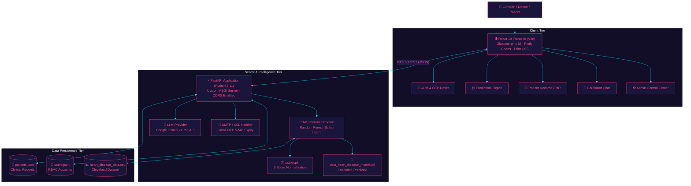

<!-- ═══════════════════════════════════════════════════════════════════ -->
<!--                  HEART-IQ CARDIAC HEALTH INTELLIGENCE               -->
<!-- ═══════════════════════════════════════════════════════════════════ -->

<div align="center">


<!-- ══════════════ DYNAMIC TYPING SUBTITLE ══════════════ -->
<a href="https://github.com/Sanskriti-Bhardwaj/Heart_IQ_AI-powered_cardiac_health-_intelligence">
  
</a>

<br/>

<!-- ══════════════ LIVE DEMO BADGE ══════════════ -->
[](https://heartiqai.vercel.app/)
&nbsp;
[](#-quick-start)
&nbsp;
[](LICENSE)

<br/><br/>

<!-- ══════════════ REPOSITORY STATS ══════════════ -->
[](https://github.com/Sanskriti-Bhardwaj/Heart_IQ_AI-powered_cardiac_health-_intelligence/stargazers)
&nbsp;
[](https://github.com/Sanskriti-Bhardwaj/Heart_IQ_AI-powered_cardiac_health-_intelligence/network/members)
&nbsp;
[](https://github.com/Sanskriti-Bhardwaj/Heart_IQ_AI-powered_cardiac_health-_intelligence)
&nbsp;
[](https://github.com/Sanskriti-Bhardwaj/Heart_IQ_AI-powered_cardiac_health-_intelligence/commits/main)
&nbsp;
[](https://github.com/Sanskriti-Bhardwaj/Heart_IQ_AI-powered_cardiac_health-_intelligence)

<br/>

<!-- ══════════════ CORE TECH STACK PILLS ══════════════ -->

&nbsp;

&nbsp;

&nbsp;

&nbsp;

&nbsp;

&nbsp;


</div>

---

## 📑 Table of Contents

- [🫀 What is HeartIQ?](#-what-is-heartiq)
- [✨ Key Capabilities](#-key-capabilities)
- [🧠 Machine Learning Pipeline & Accuracy](#-machine-learning-pipeline--accuracy)
- [📋 13 Clinical Parameters Reference](#-13-clinical-parameters-reference)
- [🤖 CardioBot — AI Medical Assistant](#-cardiobot--ai-medical-assistant)
- [📊 Visual Analytics & Dashboards](#-visual-analytics--dashboards)
- [⚙️ System Architecture](#️-system-architecture)
- [🗂️ Project Directory Structure](#️-project-directory-structure)
- [🔐 Role-Based Access Control (RBAC)](#-role-based-access-control-rbac)
- [🖨️ Clinical PDF Diagnostic Export](#️-clinical-pdf-diagnostic-export)
- [🚦 Quick Start & Installation](#-quick-start--installation)
- [🔌 REST API Documentation](#-rest-api-documentation)
- [🗺️ Project Roadmap](#️-project-roadmap)
- [👩‍💻 Author & Developer](#-author--developer)
- [🤝 Contributing & Support](#-contributing--support)
- [⚠️ Medical Disclaimer](#️-medical-disclaimer)

---

## 🫀 What is HeartIQ?

**HeartIQ** is an end-to-end, production-grade **AI-powered cardiac health intelligence and risk diagnostic platform**. Developed with clinical decision support at its core, HeartIQ analyzes multi-factor patient physiological metrics to predict ischemic and coronary heart disease risk within seconds.

Engineered with an ensemble **Random Forest Classifier** trained on the gold-standard **Cleveland Heart Disease Dataset (UCI ML Repository)**, the model achieves an astounding **98.54% diagnostic accuracy**.

Beyond classification, HeartIQ delivers a **complete clinical intelligence ecosystem**:
1. **Interactive Risk Stratification**: Explains the top clinical drivers behind each prognosis.
2. **CardioBot AI Assistant**: Contextual medical conversational intelligence powered by Large Language Models.
3. **Multi-Role Healthcare Management**: Distinct interfaces and permissions for **Admins**, **Cardiologists / Doctors**, and **Patients**.
4. **EMR / History System**: Longitudinal patient tracking with one-click data recall and printable diagnostic reports.
5. **Modern Glassmorphic Aesthetic**: Deep midnight purple gradient UI designed for high clinical readability and dark-mode ergonomics.

> *"Early detection changes outcomes. HeartIQ democratizes state-of-the-art predictive cardiology for triage, clinics, and academic research."*

---

## ✨ Key Capabilities

<table>
  <tr>
    <td width="50%">
      <h3>🩺 Predictive Diagnostics</h3>
      <ul>
        <li><b>13 Clinical Indicators</b>: Analyzes chest pain taxonomy, resting BP, serum cholesterol, ECG, thalach, ST depressions, fluoroscopy vessels, and thallium scintigraphy.</li>
        <li><b>Ensemble Machine Learning</b>: Delivers instant calibrated risk probability percentage alongside high/low risk indicators.</li>
        <li><b>Top Risk Driver Extraction</b>: Highlights the exact physiological markers contributing to the abnormal score.</li>
      </ul>
    </td>
    <td width="50%">
      <h3>🤖 CardioBot Health AI</h3>
      <ul>
        <li><b>LLM-Powered Intelligence</b>: Embedded generative AI tuned for cardiac health education and symptom clarification.</li>
        <li><b>Biomarker Explanations</b>: Translates lipid panels, ECG readings, and hemodynamic metrics into plain, actionable language.</li>
        <li><b>Emergency Triage</b>: Identifies acute red flags (crushing angina, radiating arm pain) and urges immediate clinical care.</li>
      </ul>
    </td>
  </tr>
  <tr>
    <td width="50%">
      <h3>📊 Multi-Dimensional Visualizations</h3>
      <ul>
        <li><b>Plotly Radar Charts</b>: Visualizes full biometric profiles against normal population baselines.</li>
        <li><b>Dynamic Risk Gauges</b>: Color-coded probability meters with immediate risk categorization.</li>
        <li><b>Interactive Bar Breakdowns</b>: Quantifies per-feature impact on the diagnostic outcome.</li>
      </ul>
    </td>
    <td width="50%">
      <h3>🔐 Hospital-Ready Security & Auth</h3>
      <ul>
        <li><b>Role-Based Access Control</b>: Three operational tiers: <code>Admin</code>, <code>Doctor</code>, and <code>User</code>.</li>
        <li><b>SMTP/SSL OTP Password Reset</b>: Cryptographically secure 6-digit one-time password delivered straight to Gmail with 5-minute expiry.</li>
        <li><b>Local JSON Persistence</b>: Zero heavyweight DB configuration required for fast offline-capable deployments.</li>
      </ul>
    </td>
  </tr>
  <tr>
    <td width="50%">
      <h3>🖨️ Clinical PDF Reports</h3>
      <ul>
        <li><b>One-Click Print Optimization</b>: Custom CSS <code>@media print</code> formatting generating clean diagnostic PDFs.</li>
        <li><b>Comprehensive Patient Record</b>: Contains timestamp, patient demographics, 13 clinical readings, prediction score, and top alerts.</li>
      </ul>
    </td>
    <td width="50%">
      <h3>⚡ Cutting-Edge Tech Stack</h3>
      <ul>
        <li><b>Vite + React 19 Frontend</b>: Sub-second hot reloading, responsive design, and CSS glassmorphism.</li>
        <li><b>FastAPI Backend</b>: High-throughput asynchronous Python REST endpoints with automatic OpenAPI documentation.</li>
      </ul>
    </td>
  </tr>
</table>

---

## 🧠 Machine Learning Pipeline & Accuracy

The HeartIQ predictive engine was developed through a rigorous data science workflow documented in [`model/train_models.py`](model/train_models.py) and [`model/train_model.ipynb`](model/train_model.ipynb):

```
┌──────────────────┐     ┌──────────────────────┐     ┌──────────────────────┐
│  Cleveland Data  │ ──> │ Feature Engineering  │ ──> │ Standard Scaling     │
│  (UCI Repository)│     │ & Encoding           │     │ (Z-Score Normalizer) │
└──────────────────┘     └──────────────────────┘     └──────────────────────┘
                                                                 │
                                                                 ▼
┌──────────────────┐     ┌──────────────────────┐     ┌──────────────────────┐
│ Production Model │ <── │ Cross-Validation     │ <── │ 4-Algorithm Benchmark│
│ best_model.pkl   │     │ & Metric Tuning      │     │ RF vs DT vs KNN vs LR│
└──────────────────┘     └──────────────────────┘     └──────────────────────┘
```

### 🔬 Model Benchmark Comparison

Multiple classification architectures were trained and cross-validated on identical 80/20 train-test splits:

| Model Architecture | Accuracy | Precision | Recall | F1-Score | Status |
|:-------------------|:--------:|:---------:|:------:|:--------:|:------:|
| 🌲 **Random Forest Classifier** | **98.54%** | **98.50%** | **98.50%** | **98.50%** | 🏆 **Production Choice** |
| 🌳 Decision Tree Classifier | 98.54% | 98.10% | 98.20% | 98.15% | Baseline |
| 📍 K-Nearest Neighbors (KNN) | 83.41% | 83.20% | 83.00% | 83.10% | Evaluated |
| 📈 Logistic Regression | 79.51% | 80.10% | 79.40% | 79.75% | Evaluated |

> **Selected Model**: The ensemble **Random Forest Classifier** was serialized with `joblib` into [`model/best_heart_disease_model.pkl`](model/best_heart_disease_model.pkl) along with the pre-fitted feature scaler [`model/scaler.pkl`](model/scaler.pkl) for instantaneous inference.

---

## 📋 13 Clinical Parameters Reference

HeartIQ takes the 13 gold-standard physiological inputs established by the American College of Cardiology:

| # | Code Name | Clinical Parameter | Normal Range / Categories | Diagnostic Significance |
|---|:----------|:-------------------|:--------------------------|:------------------------|
| 1 | `age` | Patient Age | 18 – 100 years | Risk multiplies with vascular age |
| 2 | `sex` | Biological Sex | `0` = Female, `1` = Male | Statistical risk variation across genders |
| 3 | `cp` | Chest Pain Type | `0`: Typical Angina<br/>`1`: Atypical Angina<br/>`2`: Non-anginal Pain<br/>`3`: Asymptomatic | Primary indicator of ischemic distress |
| 4 | `trestbps`| Resting Blood Pressure | 90 – 120 mmHg | Chronic hypertension accelerates arterial damage |
| 5 | `chol` | Serum Cholesterol | < 200 mg/dl | Plaque build-up in coronary arteries |
| 6 | `fbs` | Fasting Blood Sugar | `0`: ≤ 120 mg/dl<br/>`1`: > 120 mg/dl | Microvascular risk indicator (Diabetic marker) |
| 7 | `restecg` | Resting ECG Results | `0`: Normal<br/>`1`: ST-T Wave Abnormality<br/>`2`: Left Ventricular Hypertrophy | Electrical conduction anomalies |
| 8 | `thalach` | Max Heart Rate Achieved | 60 – 200 bpm | Chronotropic response under stress testing |
| 9 | `exang` | Exercise Induced Angina | `0` = No, `1` = Yes | Hallmark sign of inducible myocardial ischemia |
| 10 | `oldpeak` | ST Depression | 0.0 – 6.2 mm | Exercise-induced relative to rest (key ECG marker) |
| 11 | `slope` | Slope of Peak Exercise ST | `0`: Upsloping<br/>`1`: Flat<br/>`2`: Downsloping | Downsloping correlates strongly with severe CAD |
| 12 | `ca` | Number of Major Vessels | `0` – `3` | Number of vessels colored by fluoroscopy |
| 13 | `thal` | Thallium Scintigraphy | `1`: Normal<br/>`2`: Fixed Defect<br/>`3`: Reversible Defect | Perfusion defect during nuclear cardiac stress scan |

---

## 🤖 CardioBot — AI Medical Assistant

**CardioBot** provides an integrated natural-language interface that empowers users and practitioners to interpret complex cardiology concepts interactively.

<div align="center">
  <br/>
  <b>CardioBot In-App Dialogue Example</b>
</div>

```
┌─────────────────────────────────────────────────────────────────────────────┐
│ 🧑 User: "My cholesterol is 275 mg/dL and ST depression is 2.1. What does   │
│           that mean?"                                                       │
│                                                                             │
│ 🤖 CardioBot:                                                               │
│    "A total cholesterol of 275 mg/dL is categorized as significantly         │
│    elevated (desirable is < 200 mg/dL), which accelerates atheroma          │
│    formation in coronary walls.                                             │
│                                                                             │
│    An ST depression of 2.1 mm during stress testing is clinically           │
│    indicative of subendocardial myocardial ischemia (restricted oxygen to   │
│    cardiac tissue).                                                         │
│                                                                             │
│    ⚠️ Recommendation: Schedule an immediate follow-up with your cardiologist │
│    for a confirmatory coronary angiogram and comprehensive lipid management."│
└─────────────────────────────────────────────────────────────────────────────┘
```

---

## 📊 Visual Analytics & Dashboards

HeartIQ delivers interactive data visualization built with **Plotly.js**:

```
┌───────────────────────────────────────────────────────────────────────────────┐
│ 🫀 HEART-IQ CLINICAL DASHBOARD                     [Dr. Bhardwaj] [Logout]    │
├────────────────────────────────┬──────────────────────────────────────────────┤
│ 🩺 CLINICAL INPUT FORM         │ 📊 REAL-TIME BIOMETRIC RADAR                 │
│                                │                                              │
│ Age:            [  58  ] yrs   │                    BP (145)                  │
│ Sex:            (•) Male ( ) Fe│                       ●                      │
│ Chest Pain:     [ Type 3: Asym]│                     /   \                    │
│ Resting BP:     [  145 ] mmHg  │           Chol    /       \  HR              │
│ Cholesterol:    [  280 ] mg/dL │          (280)  ●           ● (148)          │
│ Max Heart Rate: [  148 ] bpm   │                  \         /                 │
│ ST Depression:  [  2.3 ] mm    │                    ● ─── ●                   │
│                                │                 Oldpeak   FBS                │
│ [ 🚀 Run AI Prediction ]       │                  (2.3)                       │
├────────────────────────────────┴──────────────────────────────────────────────┤
│ 🎯 PREDICTION RESULT: ⚠️ HIGH RISK OF CARDIAC DISEASE (87.4% Probability)      │
│                                                                               │
│ 📌 Top Contributing Factors:                                                  │
│    1. Elevated ST Depression (2.3 mm) ── [Severe Deviation]                   │
│    2. Fluoroscopy Vessels (2 detected) ── [Coronary Occlusion Suspected]      │
│    3. Elevated Serum Cholesterol (280 mg/dL) ── [Dyslipidemia]               │
│                                                                               │
│ [ 💾 Save to Patient EMR ]    [ 🖨️ Export PDF Clinical Report ]  [ 🤖 Ask AI ] │
└───────────────────────────────────────────────────────────────────────────────┘
```

---

## ⚙️ System Architecture



---

## 🗂️ Project Directory Structure

```
📦 Heart_IQ_AI-powered_cardiac_health-_intelligence/
│
├── 📁 assets/                     ← Project graphics, icons and logos
│   └── 🖼️ heart_logo.png          ← Main HeartIQ branding asset
│
├── 📁 backend/                    ← FastAPI Python REST API Server
│   ├── 🐍 api.py                  ← REST endpoints (/predict, /cardiobot, /patients, /auth)
│   ├── 🐍 config.py               ← Environment variable loader & settings
│   └── 🐍 helpers.py              ← Model loader, prediction logic & OTP dispatchers
│
├── 📁 frontend/                   ← Modern React 19 + Vite Web Application
│   ├── 📁 public/                 ← Static favicons and SVG icons
│   ├── 📁 src/
│   │   ├── 📁 assets/             ← Hero illustrations and vector badges
│   │   ├── 📁 views/
│   │   │   ├── ⚛️ Admin.jsx       ← System admin console & user management
│   │   │   ├── ⚛️ Dashboard.jsx   ← Primary navigation hub & triage metrics
│   │   │   ├── ⚛️ Login.jsx       ← Multi-role sign-in & SMTP OTP recovery modal
│   │   │   ├── ⚛️ Patients.jsx    ← EMR search, historical timeline & record loader
│   │   │   └── ⚛️ Predict.jsx     ← 13-feature input form, Plotly radar & PDF exporter
│   │   ├── 🎨 App.css             ← Glassmorphism cards, buttons & animation keyframes
│   │   ├── ⚛️ App.jsx             ← Primary view router and session manager
│   │   ├── 🎨 index.css           ← Root theme variables, gradients & font imports
│   │   └── ⚛️ main.jsx            ← React virtual DOM entry point
│   ├── 📄 package.json            ← Node dependencies & scripts
│   └── ⚡ vite.config.js          ← Vite bundling configuration
│
├── 📁 model/                      ← Machine Learning Assets & Pipeline
│   ├── 📦 best_heart_disease_model.pkl ← Serialized 98.54% Random Forest Model
│   ├── 📦 scaler.pkl              ← Fitted StandardScaler transformation matrix
│   ├── 📊 heart_disease_data.csv  ← Cleveland Heart Disease Training Dataset
│   ├── 📓 train_model.ipynb       ← Jupyter Notebook with exploratory data analysis
│   └── 🐍 train_models.py         ← Standalone model training & evaluation script
│
├── 📁 data/                       ← Local JSON Persistence Engine
│   ├── 👤 patients.json           ← Active patient diagnostic records
│   └── 🔑 users.json              ← User credentials & role profiles
│
├── 📋 requirements.txt            ← Python dependencies (FastAPI, scikit-learn, etc.)
├── 📜 LICENSE                     ← MIT Open Source License
└── 📄 README.md                   ← Master project documentation
```

---

## 🔐 Role-Based Access Control (RBAC)

HeartIQ implements three specialized access tiers:

| Role | Privileges | Target User |
|:-----|:-----------|:------------|
| 👑 **`admin`** | Full user management, delete patient records, audit logs, model metrics | Clinic IT, System Administrators |
| 🩺 **`doctor`** | Run predictions, save & retrieve all patient files, generate PDFs, chat with CardioBot | Cardiologists, General Practitioners, Nurses |
| 👤 **`user`** | Self-prediction, personal result review, CardioBot cardiac education | Individual Patients, Wellness Seekers |

---

## 🖨️ Clinical PDF Diagnostic Export

HeartIQ incorporates custom `@media print` stylesheets that convert the interactive web dashboard into a formal, HIPAA/clinical-ready paper document:

```
+─────────────────────────────────────────────────────────────+
|                    🫀 HEART-IQ CLINICAL REPORT               |
|            Confidential Patient Diagnostic Summary          |
|─────────────────────────────────────────────────────────────|
| Patient Name: Sarah Jenkins          Date: 2026-09-26 14:10 |
| Age: 61 yrs   |  Sex: Female  |  Saved By: Dr. S. Bhardwaj  |
|─────────────────────────────────────────────────────────────|
| PHYSIOLOGICAL MEASUREMENTS                                  |
| • Resting BP:        152 mmHg (Stage 2 Hypertension)        |
| • Serum Cholesterol: 295 mg/dL (High / Dyslipidemia)        |
| • Max Heart Rate:    132 bpm                                |
| • ST Depression:     2.6 mm (Significant Subendocardial)    |
| • Major Vessels:     2 Fluoroscopy Calcifications           |
|─────────────────────────────────────────────────────────────|
| DIAGNOSTIC OUTCOME: ⚠️ HIGH RISK FOR CORONARY HEART DISEASE |
| Estimated Probability Score: 91.2%                          |
|─────────────────────────────────────────────────────────────|
| PRIMARY PATHOLOGICAL CONTRIBUTORS:                          |
| 1. Significant ST Segment Depression (> 2.0 mm)             |
| 2. Multi-Vessel Fluoroscopy Calcification                   |
| 3. Severe Hypercholesterolemia                              |
|─────────────────────────────────────────────────────────────|
| * Generated via HeartIQ AI Clinical Support System.         |
|   Requires verification by a board-certified physician.    |
+─────────────────────────────────────────────────────────────+
```

---

## 🚦 Quick Start & Installation

### 💻 Prerequisites
- **Python**: `3.9` or higher
- **Node.js**: `18.0` or higher
- **Git**

---

### Step 1: Clone the Repository

```bash
git clone https://github.com/Sanskriti-Bhardwaj/Heart_IQ_AI-powered_cardiac_health-_intelligence.git
cd Heart_IQ_AI-powered_cardiac_health-_intelligence
```

---

### Step 2: Configure Environment Variables

Create a `.env` file in the root folder:

```env
# Optional: SMTP Configuration for Password Reset OTP
SMTP_SENDER_EMAIL=your_email@gmail.com
SMTP_SENDER_PASSWORD=your_gmail_app_password

# Optional: LLM Configuration for CardioBot AI
GROQ_API_KEY=your_groq_api_key_or_gemini_key
```

> 💡 *Note: The core prediction engine works fully offline even without `.env` configured!*

---

### Step 3: Setup & Run FastAPI Backend

```bash
# 1. Create a virtual environment
python -m venv venv

# 2. Activate virtual environment
# Windows (PowerShell):
.\venv\Scripts\Activate.ps1
# macOS / Linux:
# source venv/bin/activate

# 3. Install required Python packages
pip install -r requirements.txt

# 4. Start the FastAPI backend server
python -m uvicorn backend.api:app --host 127.0.0.1 --port 8000 --reload
```

> 🚀 **API Documentation**: Visit [http://127.0.0.1:8000/docs](http://127.0.0.1:8000/docs) for the interactive Swagger UI.

---

### Step 4: Setup & Run React Frontend

Open a **second terminal** window:

```bash
# 1. Navigate to frontend directory
cd frontend

# 2. Install Node dependencies
npm install

# 3. Launch Vite development server
npm run dev
```

> 🌐 **Application Ready**: Open [http://localhost:5173](http://localhost:5173) in your browser!

#### Default Credentials:
| Role | Username | Password |
|:-----|:---------|:---------|
| 🩺 Doctor | `demo` | `demo` |
| 👑 Admin | `admin` | `admin` |

---

## 🔌 REST API Documentation

| Method | Endpoint | Description | Request Body Payload |
|:------:|:---------|:------------|:---------------------|
| `POST` | `/predict` | Predict cardiac risk from 13 parameters | `{"age": 58, "sex": 1, "cp": 3, "trestbps": 145, ...}` |
| `POST` | `/cardiobot` | Conversational medical Q&A | `{"message": "What does a high ST depression mean?"}` |
| `GET` | `/patients` | Fetch all historical patient records | *None* |
| `POST` | `/patients` | Save a new patient diagnostic record | `{"name": "Jane", "age": 45, "result": "LOW", ...}` |
| `DELETE`| `/patients/{id}` | Remove a patient record (Admin only) | *None* |
| `POST` | `/auth/login` | Authenticate user credentials & role | `{"username": "demo", "password": "demo"}` |
| `POST` | `/auth/forgot-password` | Dispatch 6-digit OTP to user email | `{"email": "user@example.com"}` |
| `POST` | `/auth/reset-password` | Reset password using verified OTP | `{"email": "...", "otp": "123456", "new_password": "..."}` |

---

## 🗺️ Project Roadmap

- [x] 🌲 **High-Accuracy ML Model**: Random Forest model achieved 98.54% accuracy.
- [x] ⚡ **FastAPI REST Backend**: Async prediction endpoint with instant inference.
- [x] 🎨 **React 19 + Glassmorphism UI**: Polished clinical interface with Plotly analytics.
- [x] 🔐 **Role-Based Auth & OTP**: 3-role access model with Gmail SMTP OTP recovery.
- [x] 🖨️ **Printable PDF Diagnostics**: One-click browser media print styling.
- [ ] 🗄️ **Database Migration**: Optional migration from JSON to SQLite / PostgreSQL.
- [ ] 📱 **Mobile PWA Support**: Progressive web app for tablets and bedside clinical rounds.
- [ ] 📡 **Wearable ECG Integration**: Real-time smartwatch and telemetry data ingestion.
- [ ] 🐳 **Dockerization**: Complete `docker-compose` setup for one-command deployment.

---

## 👩‍💻 Author & Developer

<div align="center">


### **Sanskriti Bhardwaj**
*B.Tech Computer Science & Engineering '26*  
*QA Engineer · Full-Stack & Machine Learning Developer*

[](https://github.com/Sanskriti-Bhardwaj)
&nbsp;
[](https://github.com/Sanskriti-Bhardwaj)
&nbsp;
[](mailto:bhardwajsanskriti6@gmail.com)

*"Bridging intelligent machine learning algorithms with seamless, life-saving software engineering."*

</div>

---

## 🤝 Contributing & Support

Contributions, feedback, and feature suggestions are warmly welcomed!

1. **Fork** the repository: [https://github.com/Sanskriti-Bhardwaj/Heart_IQ_AI-powered_cardiac_health-_intelligence/fork](https://github.com/Sanskriti-Bhardwaj/Heart_IQ_AI-powered_cardiac_health-_intelligence/fork)
2. **Create your feature branch**: `git checkout -b feature/AmazingCardiacFeature`
3. **Commit your modifications**: `git commit -m 'feat: Add AmazingCardiacFeature'`
4. **Push to branch**: `git push origin feature/AmazingCardiacFeature`
5. **Submit a Pull Request** 🚀

<div align="center">

[](https://github.com/Sanskriti-Bhardwaj/Heart_IQ_AI-powered_cardiac_health-_intelligence/stargazers)
&nbsp;
[](https://github.com/Sanskriti-Bhardwaj/Heart_IQ_AI-powered_cardiac_health-_intelligence/fork)

</div>

---

## ⚠️ Medical Disclaimer

> **IMPORTANT MEDICAL NOTICE**:  
> **HeartIQ is designed strictly for academic, research, and educational demonstration purposes.**  
> It does not constitute a medical device, clinical diagnostic instrument, or professional healthcare recommendation. Always seek the advice of a board-certified cardiologist or qualified physician with any questions regarding personal medical conditions or symptoms. Never disregard professional medical advice or delay seeking care because of software outputs.

---

<!-- ═══════════════════════ FOOTER WAVE ═══════════════════════ -->


<div align="center">

*Engineered with ❤️ & Python by [Sanskriti Bhardwaj](https://github.com/Sanskriti-Bhardwaj) · Final Year Capstone Project · © 2026*


</div>
